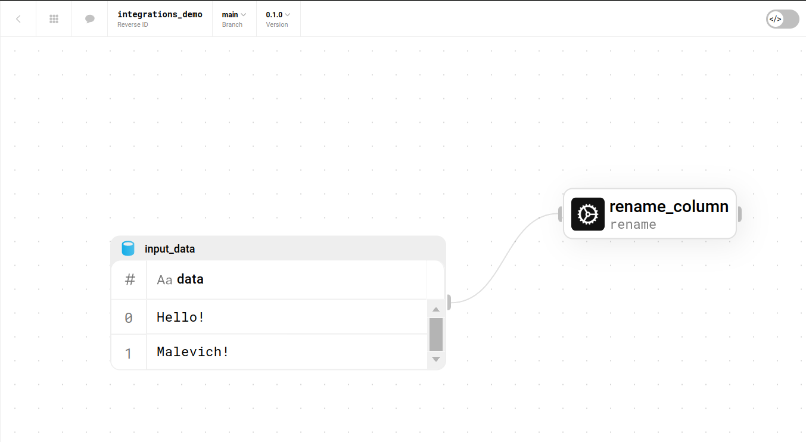

Integrations
============

You can integrate Space flows into your developing process!

Installation example
--------------------

Assume, you have the following flow:

With the following command you can install it into your malevich package:

.. code-block:: bash

    malevich space flow install "integrations_demo"

And import it from :code:`my_flows` module as a function and run it!

.. code-block:: python

    from malevich import table
    from malevich.my_flows import integrations_demo

    res = integrations_demo(
        '0.1.0',
        table({'data': ['Malevich!', 'Bye!']})
    )
    for r in res:
        print(r.get_df())

Result:

.. code-block:: bash
    
    $ python draft.py
          result
    0     Hello!
    1  Malevich!

Versioning
----------

- If option :code:`deployment-id` was provided, command will install the flow version from the deployment.

- If option :code:`branch` was provided, command will install the active version from branch provided.

- Otherwise, command will install active version of active branch.

Deinstallation
--------------

In order to remove integration, use the following command:

.. code-block:: bash

    malevich space flow delete "integrations_demo" -v < VERSION >

If you want to delete all integration versions:

.. code-block:: bash

    malevich space flow delete "integrations_demo" -a

For example:

.. code-block:: bash

    $ malevich space flow delete "integrations_demo" -v 0.1.0
    
      version 0.1.0 of integrations_demo was successfully deleted.

Command Descriptions
--------------------

.. code-block:: bash

    $ malevich space flow install --help            
                                                                                                                                                                         
    Usage: malevich space flow install [OPTIONS] REVERSE_ID                                                                                                                 
                                                                                                                                                                            
    Install flow to my flows                                                                                                                                                
                                                                                                                                                                            
    ╭─ Arguments ─────────────────────────────────────────────────────────────────────────────────────────╮
    │ *    reverse_id      TEXT  Space Flow Reverse ID [required]                                         │
    ╰─────────────────────────────────────────────────────────────────────────────────────────────────────╯
    ╭─ Options ────────────────────────────────────────────────────────────────────────────────────────────╮
    │ --deployment-id  -d      TEXT  Flow Deployment ID. If not set, will take flow from active version    │
    │ --branch         -b      TEXT  Flow branch. If not specified, will take the active one.              │
    │ --attach_any     -a            Attach to any flow deployment                                         │
    │ --help                         Show this message and exit.                                           │
    ╰──────────────────────────────────────────────────────────────────────────────────────────────────────╯

.. code-block:: bash

      $ malevich space flow delete --help                
                                                                                                                                                                                
        Usage: malevich space flow delete [OPTIONS] REVERSE_ID                                                                                                                  
                                                                                                                                                                                
        Delete flow integration.                                                                                                                                                
                                                                                                                                                                                
        ╭─ Arguments ────────────────────────────────────────────────────╮
        │ *    reverse_id      TEXT  Space Flow Reverse ID [required]    │
        ╰────────────────────────────────────────────────────────────────╯
        ╭─ Options ──────────────────────────────────────────────────────╮
        │ --version       -v      TEXT  Version to delete.               │
        │ --all-versions  -a            Delete all versions of the flow. │
        │ --help                        Show this message and exit.      │
        ╰────────────────────────────────────────────────────────────────╯